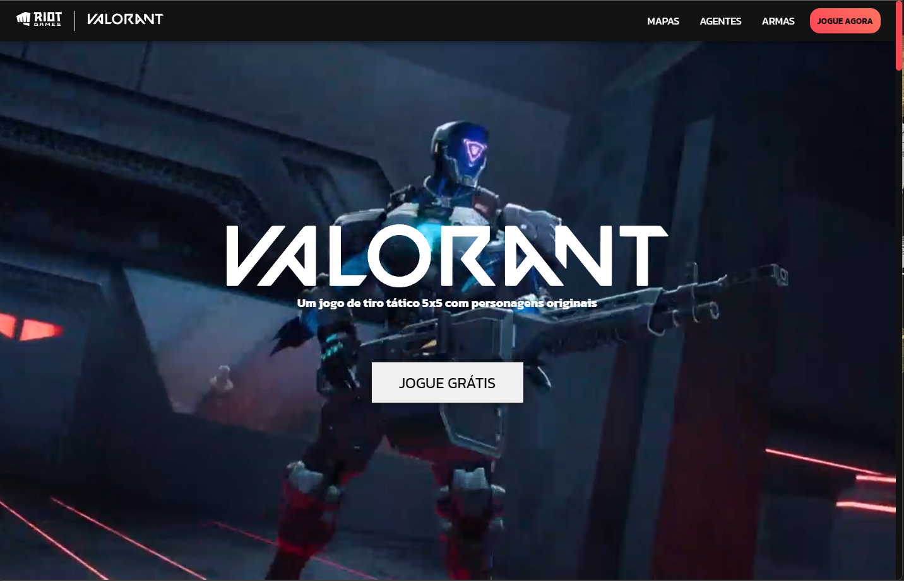
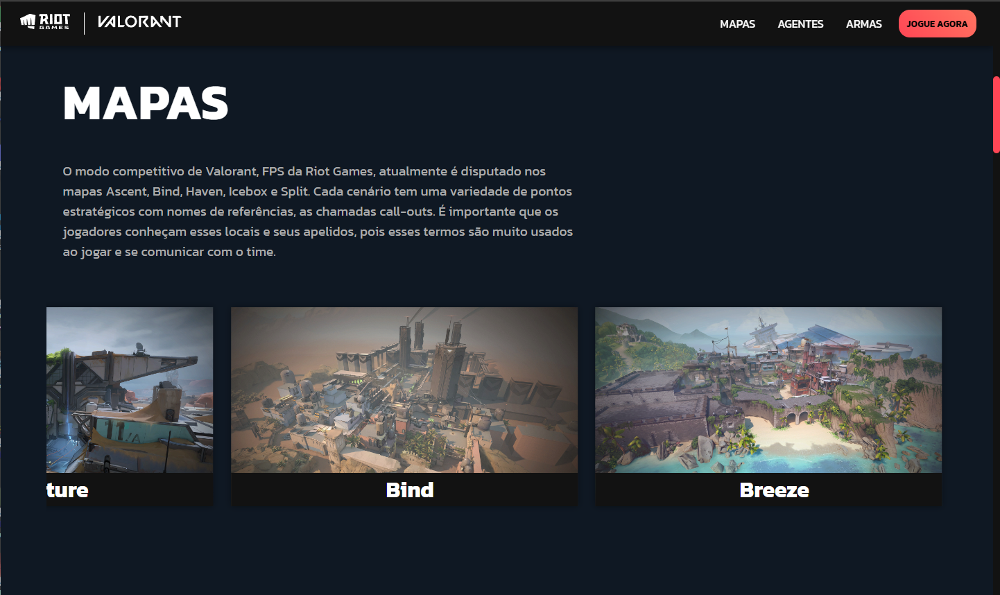
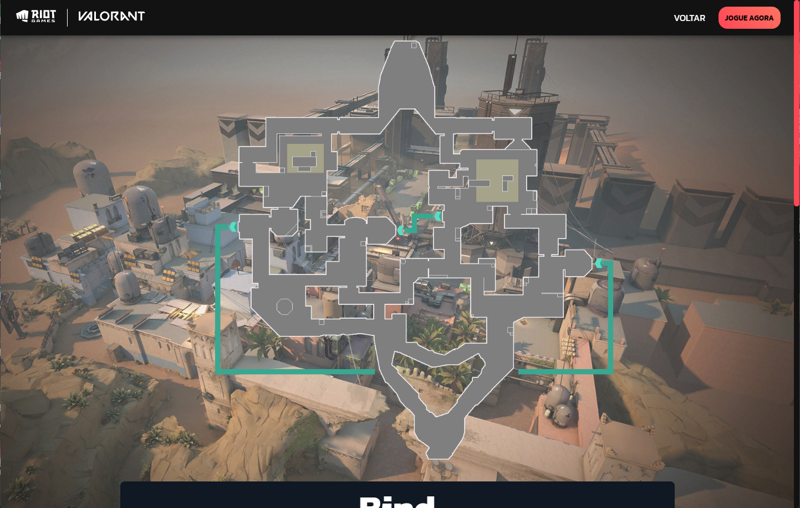
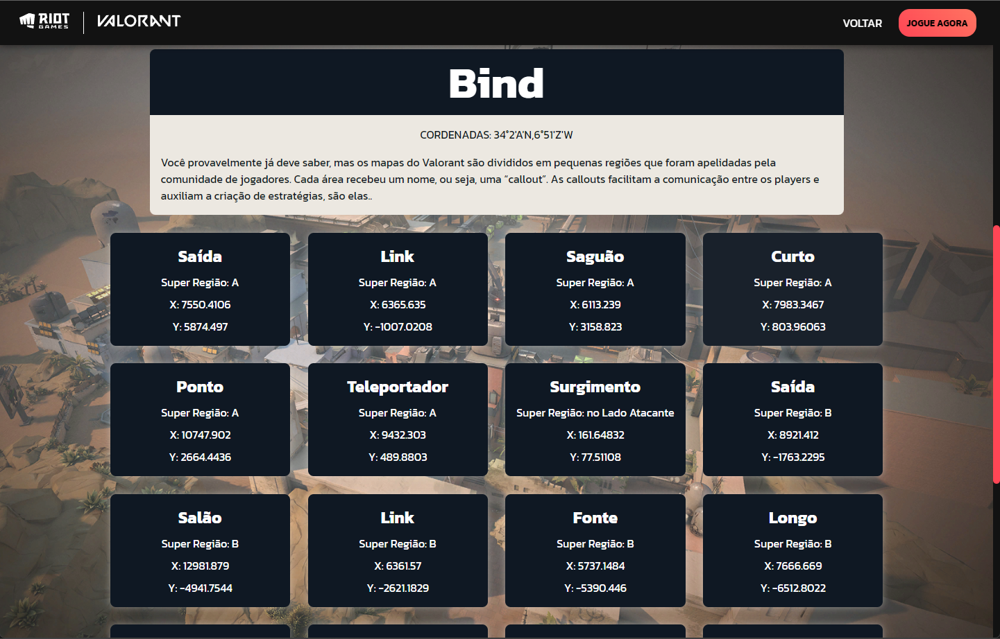
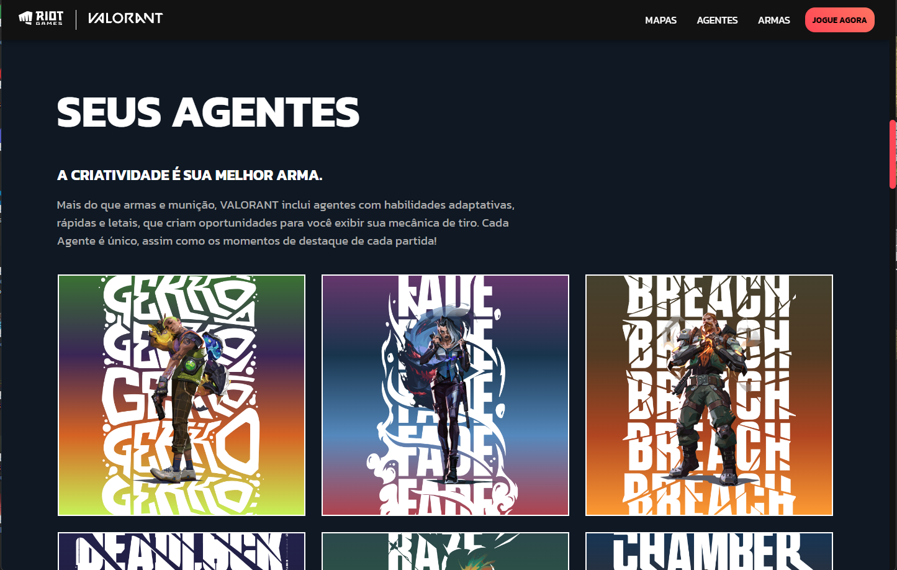
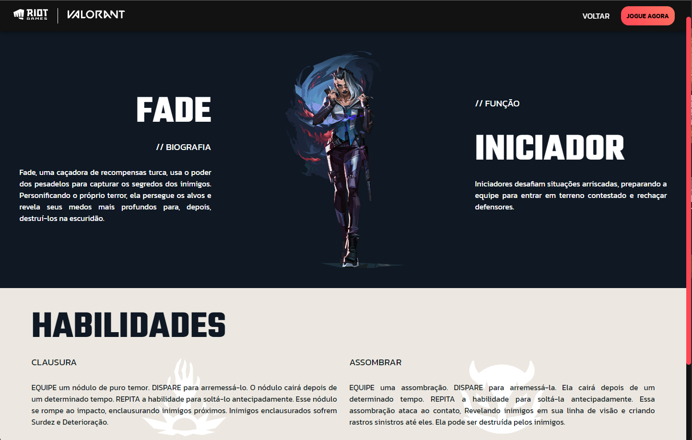
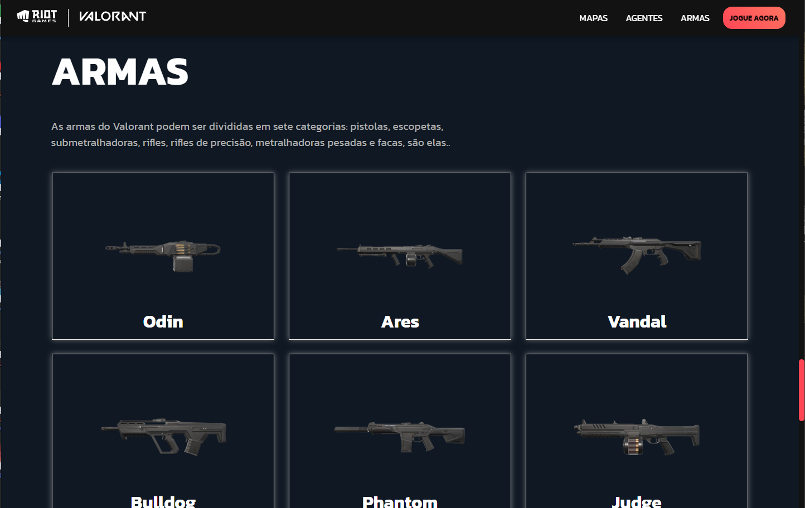
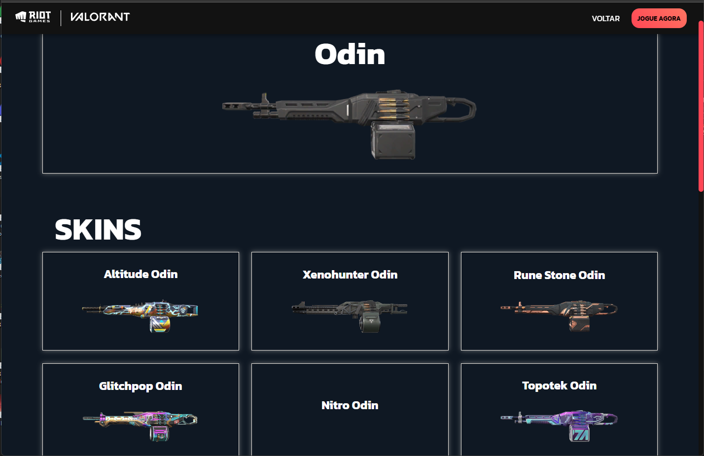
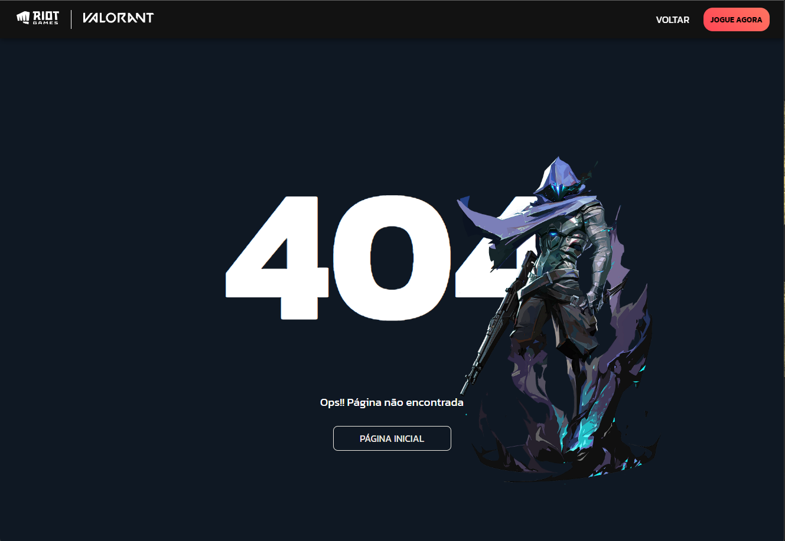
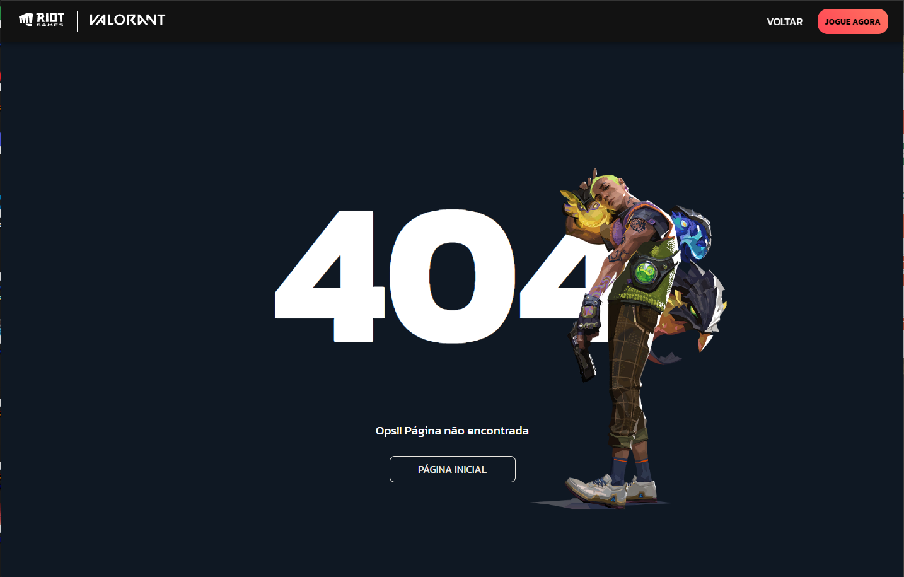

# Sobre o Projeto

Desáfio 07 dos Desáfios Codelândia criado por [iuricode 🔗](iuricode.com) "OBS: acrescentei minhas ideias em cima do desáfio".

 

    
  
 

  

    
  
  

 

    
  
 

 

    
  
 

 

   
  
 

## Ferramentas Utilizadas

React JS,  
Styled Components,  
Api: [VALORANT🔗](https://valorant-api.com/),  
Slide foi criado utilizando o motion "OBS: nessa parte utilizei CSS",  

## [ACESSAR PROJETO "netlify" 🔗](https://valorant-pablo.netlify.app/).

A intenção desse projeto e mostrar algumas estátisticas dos mapas, agentes e armas do jogo.
Botão de jogar não possúi interação.
